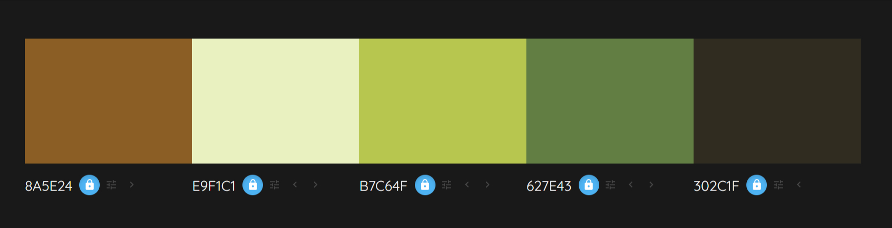
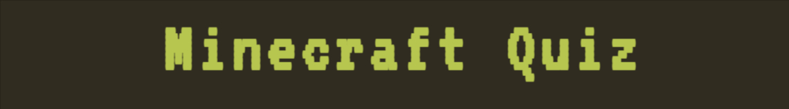
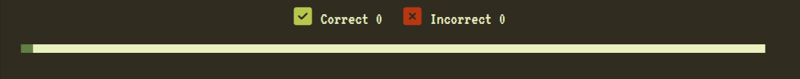
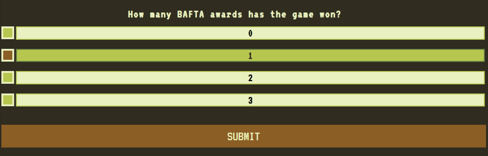
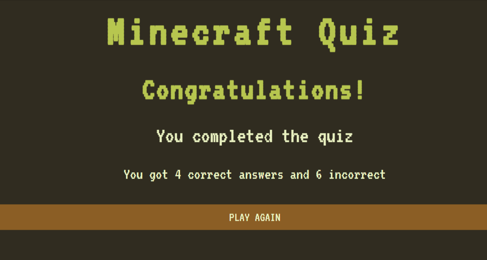
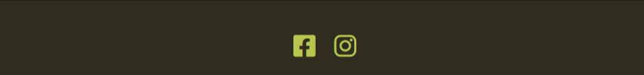

# Minecraft Quiz

The Minecraft Quiz site is targeted to kids who love to play Minecraft and would like to test their knowledge. The site is fully responsive multiple choice quiz and which allows the user to choose and answer from the prompted options. The results of correct and incorrect answer are updates as the user advance through the game.

## Color Scheme and Typography

**Fonts**: the two fonts chosen for this project was 'VT323', which has a similar style to the original MINECRAFT font, and  monospace as fallback font.

**Color Palette**:

- Dark brown #302C1F colour was used for the site background.
- Ligh green color #E9F1C1 was used for the fonts  and background buttons 
- Green colour #B7C64F was used forbuttons and hover effect on the options.
- Brown #8A5E24 colour was used for the submit and play again button and hover effect.
- Dark Green #627E43 color was used for progress bar and borders.

## **Features**

The site implements standart HTML and CSS features , as well as Javascrip for the quiz interactivity.

### **Heading**
 - Featured at the top of the page, the MIencraft Quiz heading is easy to see for the user, with distinct color and font size.

 

### **The Score Area**
- This section will allow the user to see exactly how many correct and incorrect answers they have provided.

### **The Progress Bar**
- This section will allow the user to see the progress of the game as the bar fills with each question answered.

### **The Quiz section**

- The question section where the different questions will be displayed for the user to answer as part of the game. The user will be able answer the questions by selecting one option from the multiple choice.
- The multiple choice options where different answers will be display for the user. Upon selection of the user choice, the user will be able to submit their answer by clicking the submit button. 
- The game has 10 questions for the user to answer. At the moment there is a total of 25 questions, where only 10 are randomly selected each time the game starts.
- If no answer is selected a pop-up will make it known to the user that they need to select an option to continue.

### **Final Score**
- This section contains final feedback of correct and incorrect answers and Play again button.
- Play Again button will bring user back to home page of the quiz, and start the quiz again.  

### **The Footer**
- The footer section includes links to the relevant social media sites for the Quiz. The links will open to a new tab to allow easy navigation for the user.
- The footer is consistent througout all pages.

## Features Left to Implement
- Add highscore leaderboard.
- Add more questions to the game, and to the pool of question with harder levels available.
- Add a timer for the questions.
- Create custom messages for each level of results.

## Validator Testing

- **HTML**

No errors were returned when passing through the official W3C validator.

- **CSS**

No errors were found when passing through the official (Jigsaw) validator.

- **JavaScript**

No errors were found when passing through the official Jshint validator. The following metrics were returned:

- There are 15 functions in this file.
- Function with the largest signature take 1 arguments, while the median is 0.
- Largest function has 24 statements in it, while the median is 3.
- The most complex function has a cyclomatic complexity value of 7 while the median is 1.

## Unfixed Bugs

Currently there are none unfixed bugs.

## Deployment

The site was deployed to GitHub pages. The steps to deploy are as follows:
1. In GitHub select the repository I need to deploy, navigate to the Settings tab.
2. In the left-hand navigation section select Pages
3. From the source section drop-down menu, select the Main Branch, and click SAVE.
4. After several minutes the website is live and will be automatically refreshed with each Git push command.

The link to the live site is:
 
## Credits

- The code for the score section was taken from Love Maths project.
- The code to style the radio buttons into square was taken from: https://stackoverflow.com/questions/24516958/styling-radio-buttons-into-a-square
- I would like to thanks my Mentor, Andre Aquilina who suggested I added a .jason file to store all the quiz questions and showed me how to do it.
- My kids who love Minecraft and where the inspiration for this project and also help me with  all the options for the multiple choice and tested the game as I was developing it.
- My husband who pointed helpful tutorials for me to read, and help me solve my struggles when stuck, and provided feedback on my project.
- My study group as we kept pushing each other and share helpful information.

## Content

- The questions for the quiz were taken from this website: https://groupgames101.com/minecraft-trivia/
- The favicon was generated here: https://favicon.io/favicon-generator/
- The icons for the correct and incorrect answers and footer were taken from [Font Awesome](https://fontawesome.com/)

