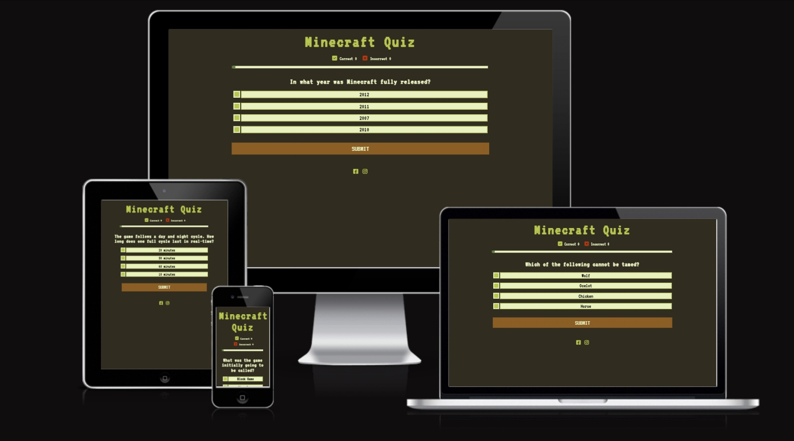
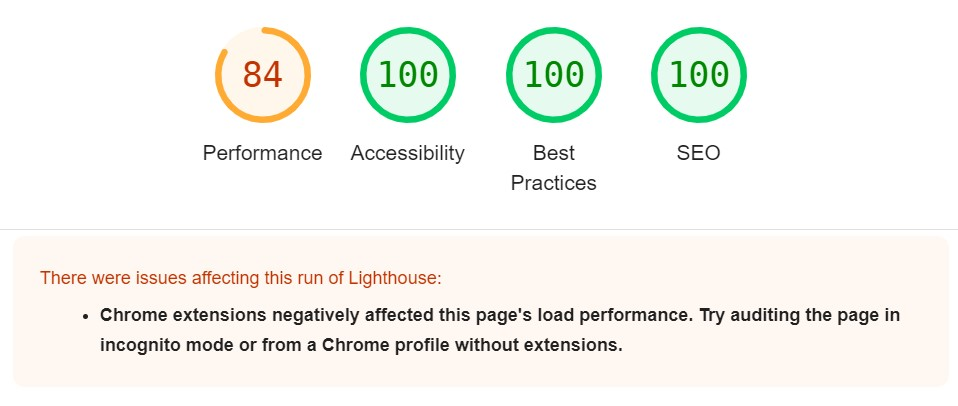
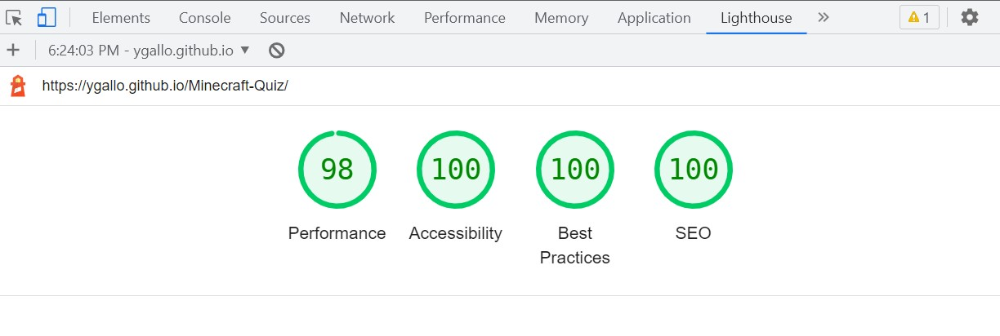

# **Minecraft Quiz**

The Minecraft Quiz site is targeted at kids who love to play Minecraft and would like to test their knowledge. The site is a fully responsive multiple choice quiz, which allows the user to choose an answer from the prompted options. The results of correct and incorrect answers are updated as the user advances through the game.

## Color Scheme and Typography

**Fonts**: the two fonts chosen for this project was 'VT323', which has a similar style to the original MINECRAFT font, and  monospace as fallback font.

**Color Palette**:

- Dark brown #302C1F colour was used for the site background.
- Ligh green color #E9F1C1 was used for the fonts and background buttons 
- Green colour #B7C64F was used for buttons and hover effect on the options.
- Brown #8A5E24 colour was used for the submit and play again button and hover effect.
- Dark Green #627E43 color was used for progress bar and borders.

## **Features**

The site implements standart HTML and CSS features , as well as Javascrip for the quiz interactivity.

### **Heading**

 - Featured at the top of the page, the Minecraft Quiz heading is easy to see for the user, with distinct color and font size.

 

### **The Score Area**
- This section will allow the user to see exactly how many correct and incorrect answers they have submitted.

### **The Progress Bar**
- This section will allow the user to see the progress of the game as the bar fills with each question answered.

### **The Quiz section**

- The question section is where the different questions will be displayed for the user to answer as part of the game. The user will be able answer the questions by selecting one option from the multiple choice.
- The multiple choice options is where different answers will be displayed for the user. Upon selection, the user will be able to submit their answer by clicking the submit button. 
- The game has 10 questions for the user to answer. At the moment there is a bank of 25 questions, only 10  questions are randomly selected each time the game starts.
- If no answer is selected a pop-up alert will make it known to the user that they need to select an option to continue.

### **Final Score**
- This section contains final feedback of correct and incorrect answers and a PLAY AGAIN button.
- The PLAY AGAIN button will bring user back to the Quiz home page, and start the game again.  

### **The Footer**
- The footer section includes links to the relevant social media sites for the Quiz. The links will open to a new tab to allow easy navigation.
- The footer is consistent througout all pages.

## Features Left to Implement
- Add highscore leaderboard.
- Add more questions to the game, and to the pool of question with harder levels available.
- Add a timer for the questions.
- Create custom messages for each level of results.

## Testing

- I have tested that this website works in Chrome, Firefox and Microsoft Edge.
- I have tested this webpage using the Chrome devtools to make sure it is responsive and functions on different screen sizes.

 | Working function  | Chrome|Firefox| Edge|
 | ------------------|:-----:|:-----:|:---:|
 | Quiz displayed correctly| ✓ | ✓ | ✓ |
 | Selection of options| ✓ | ✓ | ✓ |
 | Submit button working |✓ | ✓ | ✓ |
 | Alert displayed if no option selected| ✓ | ✓ | ✓ |
 | Increment of scores| ✓ | ✓ | ✓ |
 | Progress bar working| ✓ | ✓ | ✓ |
 | External link on new tab| ✓ | ✓ | ✓ |
 | Media query for small screens| ✓ | ✓ | ✓ |
 | Play again working| ✓ | ✓ | ✓ |

## Bugs

- When creating the questions and answers as an object, the whole code was giving an error. In trying to find the culprit, I discovered I was missing some colons, and  single quotations for the strings. This still did not fix the original problem, finally after reviewing the lessons and googling it, I realized that since there where so many questions I needed to create an Array of objects. 

- The font awesome icons for the scores have different colors (red and green), but on reloading the game, they both appeared green. I discovered first that the ID that styled the icons was not added in the javascript function that reloaded the game. Second, after adding the ID, there was a typo and once found, the issue was resolved. This type of problems with different classes and IDs on HTML and javascript, by omission on the latter, was reiterated, but once I discovered it the first time, the others where resolved quicker.

- Originally, the accessibility score in lighthouse was 91% and the error displayed was “form elements do not have associated labels” - This was resolved by adding aria-labels to the 4 inputs.

- On the final test of the game, it came to my tutor's atention that one of the options (the only one that has longer text) had a word that was displayed outside of the div and was very hard to see. I resolved this by adding a media query for smaller screens. 

- Also, on the final screen the Congratulations was too big to fit, this was adjusted with a media query.

## Unfixed Bugs

- On Firefox the submit button is displayed as *SUBMIT QUERY* instead of just *SUBMIT*, but working correctly.

## Validator Testing

- **HTML**

No errors were returned when passing through the official W3C validator.

- **CSS**

No errors were found when passing through the official (Jigsaw) validator.

- **JavaScript**

No errors were found when passing through the official Jshint validator. The following metrics were returned:

- There are 15 functions in this file.
- Function with the largest signature take 1 arguments, while the median is 0.
- Largest function has 24 statements in it, while the median is 3.
- The most complex function has a cyclomatic complexity value of 7 while the median is 1.

- **Accessibility -Lighthouse-**

Performance was affected by Chrome Extensions, on auditing the quiz on Incongnito tab, the performance when up to 98.

## Deployment

The site was deployed to GitHub pages. The steps to deploy are as follows:
1. In GitHub select the repository I need to deploy, navigate to the Settings tab.
2. In the left-hand navigation section select Pages
3. From the source section drop-down menu, select the Main Branch, and click SAVE.
4. After several minutes the website is live and will be automatically refreshed with each Git push command.

The link to the live site is: https://ygallo.github.io/Minecraft-Quiz/
 
## Credits

- The code for the score section was taken from Love Maths project.
- The code to style the radio buttons into square was taken from: https://stackoverflow.com/questions/24516958/styling-radio-buttons-into-a-square
- The classlist property was taken from: https://www.w3schools.com/jsref/prop_element_classlist.asp
- I would like to thanks my Mentor, Andre Aquilina who suggested I added a .jason file to store all the quiz questions and showed me how to do it.
- My kids who love Minecraft and where the inspiration for this project and also help me with  all the options for the multiple choice and tested the game as I was developing it.
- My husband who pointed helpful tutorials, and provided feedback on my project.
- My study group as we kept pushing each other and share helpful information and tutorials.

## Content

- The questions for the quiz were taken from this website: https://groupgames101.com/minecraft-trivia/
- The favicon was generated here: https://favicon.io/favicon-generator/
- The icons for the correct and incorrect answers and footer were taken from [Font Awesome](https://fontawesome.com/)

